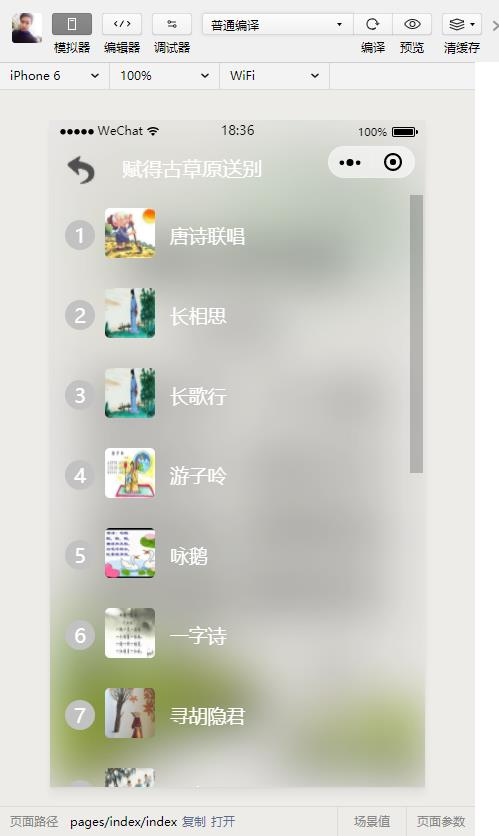
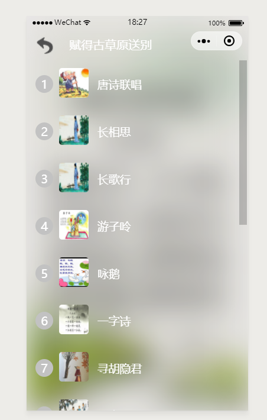

# wxapp-music

#### 项目介绍
百味博客音乐播放器小程序源代码, 自动连播，使用后端接口

# 微信小程序：百味博客音乐播放器

该小程序为针对light-music提供的源码进行优化改进
* 修复播放时间会出现毫秒显示问题
* 修复分享音乐播放问题
* 增加自动连播功能
* 优化界面列表导航位置到左边，并增加列表返回按钮（原右边和微信小程序自带的按钮重叠）
* 使用全屏显示播放器
* 修改播放器风格
* 增加使用api获取音乐列表

感谢原作者：https://github.com/facejiong/light-music-wechat-mini-programs

## 修改后的演示

#### 参与贡献

1. Fork 本项目
2. 新建 Feat_xxx 分支
3. 提交代码
4. 新建 Pull Request

## 关于作者
bywei = 程序员百味

个人博客 = "http://www.bywei.cn"

## 用户协议
* 禁止用户在使用中触犯中国法律范围内的任何法律条文。
* 不通过出售任何以此项目为基础开发的产品，仅用作自身学习研究使用。
* 任何个人，公司和组织不得以任何形式和目的侵犯百味博客的版权和著作权。
* 在未经官方书面允许的情况下，任何个人、公司和组织不能单方面发布和出售以此项目为基础开发的任何互联网软件或者产品，否则将视为侵权行为，将依照中华人民共和国法律追究其法律责任。